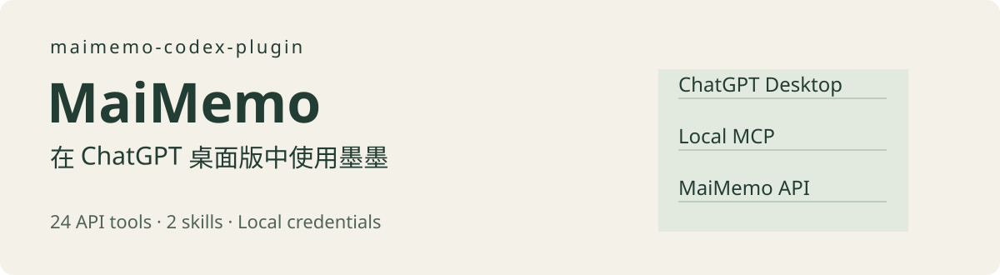

<p align="center"></p>

# maimemo-codex-plugin

用自然语言查询墨墨单词、整理云词本、查看学习进度。**非官方开源插件**，使用[墨墨官方开放 API](https://open.maimemo.com/)。支持 Windows 本地 Codex；其他本地 MCP 客户端可使用 `mcp.json`，尚未实机验证。需要 Node.js 22 或更高版本。

```text
查一下 resilient 在墨墨词库里的信息。
列出我的云词本，读取名为“六级核心词”的词本。
看看我今天的新学和复习进度，给我安排一组自测题。
把下面这些单词整理成云词本草稿，标题“阅读生词”：...
```

## 能做什么

| 功能 | 工具与说明 |
| --- | --- |
| 查单词 | 单个拼写查询、批量拼写或 ID 查询 |
| 云词本 | 列表、详情、创建、更新、删除 |
| 学习素材 | 查询、创建、更新、删除例句、助记和释义 |
| 学习复盘（公测） | 今日进度、今日单词、学习记录 |
| 学习操作（公测） | 添加单词、提前复习 |

共 **24 个 API 工具 + 1 个本地配置检查工具**，以及 `maimemo-vocabulary`、`maimemo-study` 两个 skill。MCP 是实际连接工具；skill 告诉 Codex 如何整理词汇、调用接口和判断结果。安装插件会一起安装它们。

不包含墨墨记忆卡 Markji、模拟手机点按钮、自动答题或自动打卡。官方学习接口需要 App 开启自动同步，当天打开 App 初始化；公测期间可用性可能变化。提前复习接口说明需达到 10 级。

## 安装到 Codex

仓库已包含打包的运行文件，无须先安装 npm 依赖。安装前确认 `node --version` 至少为 22。

推荐直接从 GitHub 添加插件源，无须手动 clone。需要支持 plugin marketplace 的新版 Codex CLI：

```powershell
codex plugin marketplace add ZiChen-Whisper/maimemo-codex-plugin --json
codex plugin add maimemo-codex-plugin@maimemo-community --json
```

如果要在本地修改源码，也可以先 clone：

```powershell
git clone https://github.com/ZiChen-Whisper/maimemo-codex-plugin.git
cd maimemo-codex-plugin
codex plugin marketplace add . --json
codex plugin add maimemo-codex-plugin@maimemo-community --json
```

重新打开 Codex chat，检查插件列表中 `maimemo-codex-plugin` 已启用。若宿主提示信任/连接权限，按提示允许。此插件是本地进程，不能直接在 ChatGPT 网页或手机端运行；也不需要把 API token 上传到云端。若旧 CLI 无法解析配置或找不到插件，使用新版 CLI 或桌面版自带 CLI，见 [兼容性记录](docs/verification.md)。

### plugin、skill、MCP 和 npm/npx

按照 [OpenAI 的插件机制](https://developers.openai.com/plugins/concepts/plugins)，plugin 是可安装的能力包；skill 描述工作流程，MCP 服务器提供实际工具。本项目把两个 skill 和墨墨 API 工具打包在一起。GitHub 开源与发布到 OpenAI 公共插件目录是两件事：本项目目前通过自建 marketplace 分发，没有提交公共目录。

`npm install` 安装 Node.js 软件包或依赖；`npx` 运行软件包中的命令。它们本身不会自动把一个目录注册成 Codex 插件。本项目尚未发布 npm 安装器，所以不能使用 `npx maimemo-codex-plugin` 安装完整插件。

例如第三方 [skills CLI](https://www.skills.sh/docs/cli) 可以从 GitHub 安装 skill：

```powershell
npx skills add ZiChen-Whisper/maimemo-codex-plugin
```

这条命令只安装 skill，不会替你配置本项目的 MCP 服务器或 token。本项目的 skill 会调用墨墨 MCP 工具，所以正常使用请安装完整插件。这里仅解释命令区别，未运行该第三方安装命令。

## 配置 token

安装插件与配置墨墨账号是两步。**安装时不用把 token 写进插件。** 从墨墨 App「我的 → 更多设置 → 实验功能 → 开放 API」取得 token。若使用直接从 GitHub 安装的方式，运行安装缓存内的脚本（以下路径对应当前 0.1.2 版本；使用自定义 CODEX_HOME 时请调整路径）：

```powershell
$tokenSetupScript = Join-Path $env:USERPROFILE '.codex\plugins\cache\maimemo-community\maimemo-codex-plugin\0.1.2\scripts\configure.ps1'
powershell -NoProfile -ExecutionPolicy Bypass -File $tokenSetupScript
```

若已 clone 仓库，也可以在仓库目录运行：

```powershell
powershell -NoProfile -ExecutionPolicy Bypass -File .\scripts\configure.ps1
```

按提示隐藏输入。脚本保存到 `%USERPROFILE%\.config\maimemo-codex-plugin\token`，限制 Windows 目录权限为当前用户；文件是受文件权限保护的明文，并非加密凭证保险库。不要共享这个文件。替换 token 时重新运行同一脚本，移除用 `-Remove`。

从旧名称升级时，原来的 `.config/maimemo-plugin/token` 仍可读取，无须重新输入。优先级为环境变量、新凭证文件、旧凭证文件。删除旧凭证需单独移除旧文件；`configure.ps1 -Remove` 只移除新路径文件。

也支持 `MAIMEMO_TOKEN` 环境变量，优先级高于凭证文件。需要启动 Codex 的进程能继承该变量；修改环境后重启 Codex。Linux/macOS 可在相同用户目录创建 `~/.config/maimemo-codex-plugin/token` 并设置目录 700、文件 600，或使用环境变量；该路径尚未实机验证。不要把 token 写进 `.mcp.json`、源码或聊天。

## 第一次使用

新开 chat 后对 Codex 说：

> 使用墨墨插件，检查连接，然后查询 apple。只读取，不修改我的数据。

`connection_status` 只检查本地配置。成功查询 apple 才说明远端凭证可用。继续可以说：

> 查看我今天的学习进度；如果返回数据不完整，告诉我需要在 App 做什么。

> 读取“六级核心词”云词本，挑出 10 个词给我做中译英自测。

> 将 resilient、sustain、comprise 创建为云词本草稿，标题“六级阅读生词”。

> 把这些词加入我的学习计划，不提前复习。

云词本和学习计划是不同功能。写入需要你明确指定操作；工具另要求 `confirm=true`，由 Codex 根据你的授权传入。这是调用方的声明，不能代替宿主权限控制。

## 连接失败时

| 现象 | 处理 |
| --- | --- |
| 插件有 skill 但没有工具 | 确认 Node 在 PATH、插件启用；新开 chat，检查本地 MCP 启动日志 |
| 未配置 token | 运行 configure.ps1；若环境变量残留旧 token，先清除或更新 |
| 401 | 检查 token 是否无效或过期 |
| 403 | 检查账号权限、接口开放情况 |
| 429 | 等待后再试；多个客户端共用账号频控 |
| 学习数据为空或不准 | 打开墨墨 App 并启用自动同步，确认当天已初始化 |
| 写入超时 | 先查询实际结果，再决定是否重试，避免重复创建 |

本插件按进程串行调用，间隔至少 2 秒；不自动重试写操作。官方限制为 10 秒 20 次、60 秒 40 次、背单词 5 小时 2000 次，例句/助记/释义合计每天最多创建 600 条。长时间持续调用和多个进程仍可能触及累计限制。

## 开发与验证

```powershell
npm ci
npm test
npm run build
npm run smoke
node scripts/smoke.mjs --live
```

`--live` 仅调用查词、词本列表、今日进度三个读取接口；输出连接状态和响应字段名，不打印词本内容。源码或 schema 变更后要重新 build，提交同步的 `server/dist/` 文件。

完整工具列表见 [docs/tools.md](docs/tools.md)，验证范围见 [docs/verification.md](docs/verification.md)。接口 schema 从官方 YML 导出生成；原始导出文件不随仓库发布。重新生成需要 Python 和 PyYAML：

```powershell
python scripts/generate_catalog.py <你的官方YML路径>
npm run build
```

## 隐私与许可证

请求只发送到 `https://open.maimemo.com/open`，拒绝重定向，token 只用于 Authorization。没有遥测，也不在磁盘记录 API 响应。查到的词本或学习数据会进入发起调用的 AI chat；是否同步聊天取决于你使用的宿主设置。

项目自编代码采用 [MIT](LICENSE)。接口名称、schema 和说明来自墨墨官方文档，墨墨商标及服务归原权利人；MIT 不授权使用墨墨服务或第三方内容。运行包依赖的许可证见 [THIRD_PARTY_NOTICES.md](server/dist/THIRD_PARTY_NOTICES.md)。
